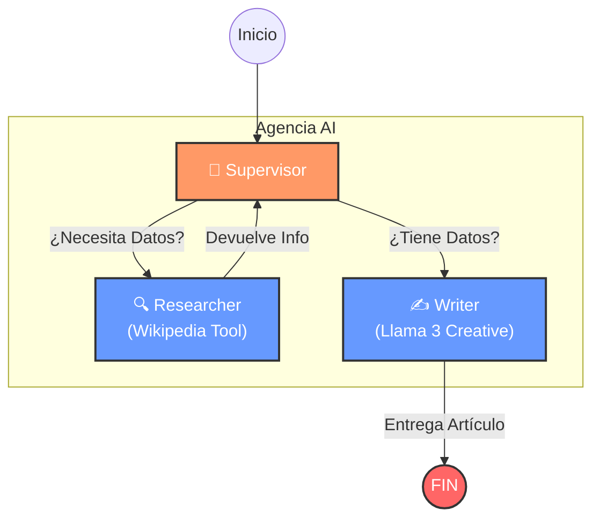

# 🕵️‍♂️ Agencia de Marketing AI: Local, Privada & Autónoma

<div align="center">


*Proyecto desarrollado para la iniciativa **#DiciembreDeAgentes 2025** (Día 20)*

[Ver Iniciativa](https://dev.to/icebeam7/diciembre-de-agentes-2025-4oob) | [Reportar Bug](https://github.com/jmatias2411/agentes-langgraph-diciembre/issues)

</div>

---

## 📖 Descripción

¿Cansado de pagar por tokens de API? Este proyecto despliega un **equipo de agentes de Inteligencia Artificial** que vive 100% en tu ordenador.

Utilizando **LangGraph** para la orquestación y **Ollama** para la inferencia, simulamos una pequeña agencia de contenidos donde dos agentes especializados colaboran para entregar resultados de calidad:

1.  **🔍 Investigador:** Navega por Wikipedia para extraer datos fácticos y reales.
2.  **✍️ Redactor:** Sintetiza la información y crea artículos de blog estructurados y atractivos.
3.  **🧠 Supervisor:** Un router inteligente que coordina el flujo de trabajo y asegura que la tarea se complete.

Todo esto presentado en una **Interfaz de Línea de Comandos (CLI)** moderna y colorida gracias a `rich`.

---

## 📸 Demo


> **Ejemplo de Flujo:**
> Usuario: "Escribe sobre el impacto de la IA en la medicina"
> 1. Supervisor detecta falta de información -> Delega a Investigador.
> 2. Investigador busca en Wikipedia -> Encuentra artículos relevantes.
> 3. Supervisor recibe datos -> Delega a Redactor.
> 4. Redactor escribe el post en Markdown -> **Fin del proceso.**

---

## 🏗️ Arquitectura del Sistema

El proyecto implementa un patrón **Supervisor/Worker** usando un Grafo de Estado (`StateGraph`).


```mermaid
graph TD
    %% Estilos
    classDef brain fill:#f96,stroke:#333,stroke-width:2px,color:white;
    classDef worker fill:#69f,stroke:#333,stroke-width:2px,color:white;
    classDef endNode fill:#f66,stroke:#333,stroke-width:2px,color:white;

    Start((Inicio)) --> Supervisor
    
    subgraph "Agencia AI"
        Supervisor[🧠 Supervisor]:::brain
        Researcher["🔍 Researcher<br>(Wikipedia Tool)"]:::worker
        Writer["✍️ Writer<br>(Llama 3 Creative)"]:::worker
    end

    Supervisor -->|¿Necesita Datos?| Researcher
    Supervisor -->|¿Tiene Datos?| Writer
    
    Researcher -->|Devuelve Info| Supervisor
    Writer -->|Entrega Artículo| End((FIN)):::endNode

```

---

## 🚀 Instalación Rápida

Este proyecto utiliza **[uv](https://github.com/astral-sh/uv)** para una gestión de dependencias ultra-rápida y moderna, aunque también soporta `pip`.

### Prerrequisitos

1. **Python 3.10** o superior.
2. **[Ollama](https://ollama.com/)** instalado y ejecutándose en segundo plano.
3. Modelo Llama 3 descargado:
```bash
ollama pull llama3.1

```


### Opción A: Usando `uv` (Recomendado ⚡)

```bash
# 1. Clonar el repositorio
git clone https://github.com/jmatias2411/agentes-langgraph-diciembre.git
cd agentes-langgraph-diciembre

# 2. Sincronizar entorno (instala todo automáticamente)
uv sync

# 3. Ejecutar
uv run main.py

```

### Opción B: Usando `pip` (Clásico 🐢)

```bash
# 1. Crear entorno virtual
python -m venv .venv
source .venv/bin/activate  # Windows: .venv\Scripts\activate

# 2. Instalar dependencias
pip install langchain-ollama langgraph langchain-community rich wikipedia

# 3. Ejecutar
python main.py

```

---

## 📂 Estructura del Código

El proyecto sigue una arquitectura modular limpia, ideal para aprender **LangGraph**:

| Archivo | Descripción |
| --- | --- |
| `main.py` | **Punto de entrada**. Maneja la UI con Rich y el bucle de input. |
| `agent/graph.py` | Define la arquitectura del grafo (nodos y aristas). |
| `agent/nodes.py` | Contiene la lógica de los agentes (Prompts y Herramientas). |
| `agent/state.py` | Define la memoria compartida (`TypedDict`) del equipo. |
| `utils/llm.py` | Configuración centralizada de los modelos Ollama. |

---

## ⚙️ Personalización

¡Haz tuyo este proyecto! Aquí tienes ideas para modificarlo:

* **Cambiar el Modelo:** Ve a `utils/llm.py` y cambia `MODEL_NAME` por `mistral`, `gemma:2b` o `deepseek-coder`.
* **Cambiar el Idioma:** En `agent/nodes.py`, modifica `WikipediaAPIWrapper(lang="es")` a `lang="en"` o `lang="fr"`.
* **Ajustar Creatividad:** En `utils/llm.py`, sube la `temperature` del `llm_creative` a `0.9` para textos más locos.

---

## 🛠️ Solución de Problemas

**1. Error: `ConnectionRefusedError` o "Ollama not reachable"**

* Asegúrate de que la aplicación de escritorio de Ollama esté abierta y corriendo.
* Prueba en tu terminal: `ollama run llama3.1 "hola"`.

**2. Error: El agente entra en bucle infinito**

* Asegúrate de estar usando el código actualizado de este repo. Hemos implementado un "Hard Stop" en el nodo `Writer` para evitar alucinaciones cíclicas.

**3. La búsqueda de Wikipedia falla**

* A veces Wikipedia no encuentra términos muy específicos. Intenta con temas más generales (ej: "Inteligencia Artificial" en lugar de "IA Generativa Agéntica 2025").

---

## 🤝 Contribuciones

Este es un proyecto de código abierto creado para la comunidad. ¡Los PRs son bienvenidos!
Si tienes ideas para nuevos agentes (ej: un agente que genere imágenes, o uno que valide código Python), anímate a colaborar.

---
Hecho con ❤️ y ☕ por [Matías Palomino](https://github.com/TU_USUARIO)

¡Si te sirvió, dale una estrella ⭐ al repo!

